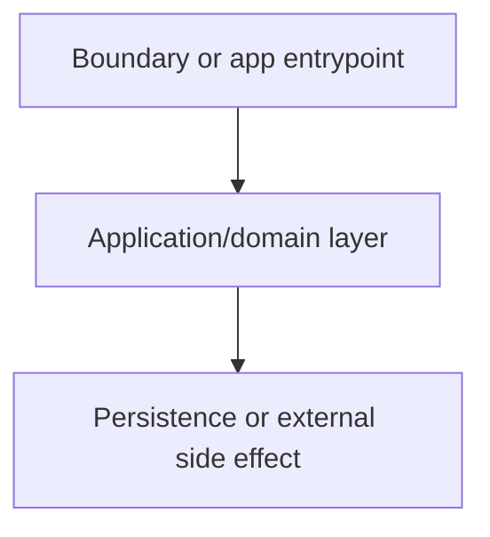
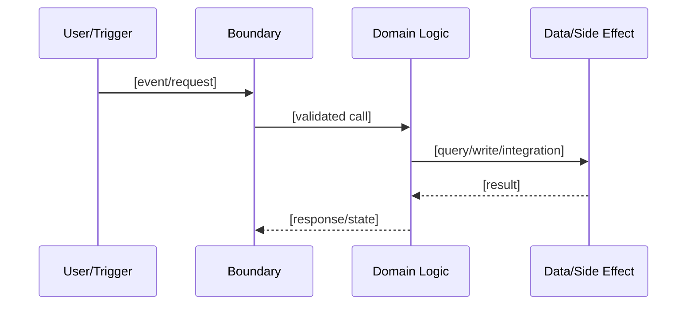

# Field Guide Template

Use this when producing the final output for `codebase-discovery`. Keep the same overall Codebase Field Guide shape across modes, then adjust depth and emphasis.

## Codebase Field Guide

# Codebase Field Guide: [System/Repo Name]

## Orientation

- Mode: [Full discovery / Change discovery / Limited-access discovery]
- Scope covered: [repos, modules, flows, timebox]
- Access level: [full repo / partial repo / snippets / docs only / read-only / no runtime]
- Confidence: [high / medium / low + why]
- What this system does: [plain-language summary]
- Main things to understand first: [3-6 bullets]

## Staged Reading Path

### 1. Start Here

- [file/path] - [why this is first]
- [file/path] - [what it teaches]

### 2. Runtime Entrypoints

- [file/path] - [server/app/router/worker/CLI role]
- [file/path] - [how execution begins or routes]

### 3. Domain and Data Model

- [file/path] - [entities, schema, migration, generated types, validators]
- [file/path] - [business terms or lifecycle states]

### 4. Core Flows to Follow

- [flow name] - [why it teaches the system]
- [flow name] - [why it matters]

### 5. Conventions to Copy

- [file/path] - [best example for routes/components/services/tests/etc.]
- [file/path] - [pattern to imitate]

## System Map

[Brief prose explanation of the architecture.]

Evidence:
- [map node] -> [file/path]
- [map node] -> [file/path]

Use multiple focused diagrams if one diagram becomes too dense.

## Core Flows

### [Flow Name]

Steps:
1. [file/path] - [what happens]
2. [file/path] - [handoff]
3. [file/path] - [persistence, side effect, or response]

Verification:
- [test file or command if known]
- [manual/local check if no tests found]

Unknowns:
- [uncertain handoff or missing runtime context]

Repeat for 2-4 important flows in Full discovery. For Change discovery, focus on the target flow and its immediate dependencies.

## Working Model: Where Things Live

| Kind of work | Where to look | Best examples to read | Verification |
|---|---|---|---|
| UI/presentation | [paths] | [paths] | [command/test] |
| API/boundary | [paths] | [paths] | [command/test] |
| Domain rules | [paths] | [paths] | [command/test] |
| Data/persistence | [paths] | [paths] | [command/test] |
| Background jobs/integrations | [paths] | [paths] | [command/test] |
| Config/runtime | [paths] | [paths] | [command/test] |
| Tests/fixtures | [paths] | [paths] | [command/test] |

Omit rows that do not apply. Add repo-specific categories when useful.

## Conventions and Patterns

### [Pattern or Convention]

- What to copy: [short explanation]
- Examples: [file/path], [file/path], [file/path]
- Enforced by: [tooling/tests/generator/convention only]
- Exceptions or drift: [old pattern, generated code, local module exception]
- Maintainer implication: [how this helps future work land correctly]

Repeat for the conventions that actually matter for future maintainers.

## Local Workflow

- Install/setup: [commands or docs]
- Run app/services: [commands]
- Build/type-check/lint: [commands]
- Tests: [commands, fastest targeted path, slower suites]
- Database/migrations/seed data: [commands or notes]
- Debugging/logging: [where to look]
- Environment/services: [env vars, local ports, containers, credentials, external dependencies]
- Unsafe or unclear commands: [commands to avoid or confirm before running]

## Maintenance Cautions

### [Area to Treat Carefully]

- What to watch: [concrete caution]
- Evidence: [file paths, repeated samples, command output, docs mismatch, git-history signal]
- Why it matters: [maintainer impact]
- How to move safely: [examples to read, checks to run, boundary to preserve, context to confirm]
- Confidence: [high / medium / low]

Keep this section practical. Do not convert it into ranked remediation or backlog.

## Optional Git-History Signals

Use only when inspected.

- Active areas: [files/modules with recent changes]
- Churn hotspots: [files/modules]
- Files that change together: [co-change clues]
- History-informed context: [migration, rewrite, old/new pattern, docs freshness]

## Confidence Checks

After reading this guide, the user should be able to answer:

- What does this system do in one paragraph?
- What are the main runtime entrypoints?
- What are the major modules/layers and how do they relate?
- How does one core flow move from boundary to persistence or side effect?
- Where do validation, authorization, persistence, config, and tests live?
- Which examples should be copied for common future changes?
- Which verification commands give fast confidence?
- Which areas deserve extra care and why?

## Open Questions

- [Question needing runtime access, team context, credentials, product context, or broader repo access]
- [Assumption that should be confirmed]

## Mode-Specific Emphasis

### Full Discovery

Fill the whole guide broadly. Include a staged reading path, at least one system map, 2-4 core flows when available, conventions, where-common-changes-go guidance, local workflow, maintenance cautions, and confidence checks.

### Change Discovery

Start with enough global context to orient the user, then deepen the named feature, module, bug, or flow. The "Working Model" should focus on files likely relevant to that area without inventing a task plan.

### Limited-Access Discovery

Use the same shape, but keep confidence labels visible. Separate observed facts, likely inferences, and unknowns. Avoid strong convention claims unless repeated examples are available.

## Writing Rules

- Prefer "here is how this codebase works" over "here is what is wrong."
- Use file paths and commands as evidence.
- Keep diagrams readable and evidence-backed.
- Do not suggest product tasks, backlog items, or code changes unless requested.
- Do not recommend rewrites unless the user asks for remediation planning.
- Do not expose secret values.
- Use concise explanations a maintainer can act on.
